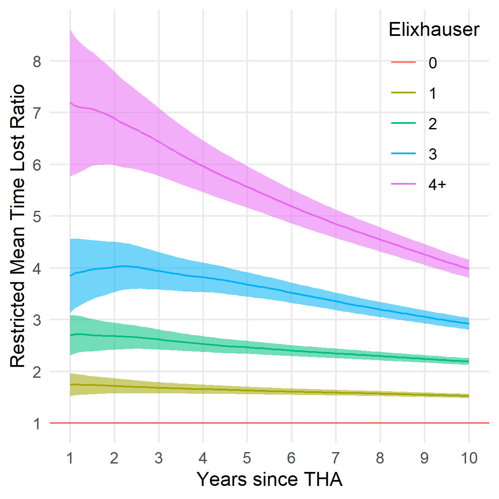

```{r setup, include = FALSE}
options(
  digits            = 1,
  knitr.kable.NA    = '',
  repos = list(CRAN = "https://cran.rstudio.com/")
)
knitr::opts_chunk$set(echo = FALSE, root.dir = '..')
library(tidyverse)
load("../cache/df.RData")
N <- format(nrow(df), big.mark = ",")

# RMTL 90 days after THA
load("../cache/rmst_rmtl.RData")
rmtl <- 
  rmst_rmtl %>% 
  unnest(cols = data) %>% 
  filter(days %in% c(30, 90, 3650))

rmtl30d <- filter(rmtl, days == 30) %>% mutate(rmtl = rmtl * 365.241 * 24)
rmtl90d <- filter(rmtl, days == 90) %>% mutate(rmtl = rmtl * 365.241)
rmtl10y <- filter(rmtl, days == 3650)
```

ORIGINAL RESEARCH

Bulow et al.

# Restricted mean survival time decrease with increased comorbidity for patients with total hip arthroplasty: An observational register study of `r N` patients from the Swedish Hip Arthroplasty Register 1999-2015

Erik Bulow^1,2^
Ola Rolfson^1,2^
Szilard Nemes^1,2^


^1^	Swedish Hip Arthroplasty Register, Gothenburg, Sweden. 
^2^	Department of Orthopaedics, Institute of Clinical Sciences, The Sahlgrenska Academy, University of Gothenburg, Gothenburg, Sweden. 

*Correspondence:* Erik Bulow, SHPR, Registercentrum Vastra Gotaland, 415 43 Gothenburg, Sweden.
Tel: +46 7008234 28. E-mail: erik.bulow@rccvast.se


# Abstract

<!-- Max 300 words -->

**Purpose — ** We investigated the long-term association between increased comorbidity and remaining life time, for patients with total hip arthroplasty (THA) in a Swedish national cohort.

**Patients and methods — ** We studied `r N` patients operated with THA 1999-2015, recorded in the Swedish Hip Arthroplasty Register, linked to the National Patient Register from the National Board of Health and Welfare. We estimated the restricted mean survival time (RMST), and the restricted mean time lost (RMTL) stratified by the Elixhauser comorbidity index. 

**Results — ** RMTL 90 days after surgery ranged from `r min(rmtl90d$rmtl)` to  `r max(rmtl90d$rmtl)` days and increased by comorbidity. Differences were statistically significant but likely clinically irrelevant. RMTL 10 years after surgery ranged from `r round(min(rmtl10y$rmtl) * 365.241)` days (no comorbidity) to `r max(rmtl10y$rmtl)` years (4 or more comorbidities). Those differences were statistically significant and clinically relevant. 

**Conclusion — ** Baseline comorbidity indicates expected long-term survival after THA.

**Keywords:** survival analysis, hip replacement, Elixhauser, register study


# Introduction

Comorbidity indices (such as proposed by Elixhauser et al.[@Elixhauser1998] or Charlson et al.[@Charlson1987]) are common components of joint replacement studies. It has been showed however that they add little to the understanding of health-related quality of life [@Greene2015a], occurrence of re-operations [@Gordon2013] or mortality [@Bulow2017]. Beside considering comorbidity indices and joint replacement, these papers have yet another common theme, they are predictive studies, and their assessment strictly applies to predictions. Prediction and estimation are often used interchangeably, although a clear distinction should be made [@Shmueli2011]. Predictive studies or risk calculators aim to predict the outcome for a specific patient (or groups of patients with similar characteristics). Baseline comorbidity indices seemingly adds little in this case. Etiological studies of association between exposures and outcomes on the other hand, could still benefit from considering comorbidity on a population level. Such studies have showed that comorbidity indices are associated with survival [@Glassou2017], as well as with medical expenses [@Penna2019], for patients on average.

Our aim in this paper was to assess the association between the Elixhauser comorbidity index and the expected remaining survival time after total hip arthroplasty (THA). This study is descriptive and departs from usual regression modeling as it does not rely on hazard ratios. Instead, we focus on group specific survival times, a clinically meaningful and model-free measure [@Uno2014; @Irwin1949]. The restricted mean survival time and the restricted mean time lost [@Royston2013] give the average remaining life expectancy of patients, and inversely the life time lost up to a pre-defined time point. Both measures are easily interpreted as their unit is a measure of time (days, months or years) and they are easily estimated at clinically meaningful time points. 


# Patients and Methods


## Patients

We identified patients from the Swedish Hip Arthroplasty Register (SHAR) who underwent THA for primary hip osteoarthritis 1999–2015 and who matched our inclusion criteria (Figure \@ref(fig:flowchart)). For patients with bilateral THA, start time was set at the second hip arthroplasty [@Bulow2019a].

These patients were linked to the Swedish National Patient Register (NPR) using the unique Swedish identity numbers [@Cnudde2016]. NPR provided ICD-10 codes recorded at hospital visits for each patient during one year before surgery. Individual ICD-10 codes were first identified as different comorbidities by the Elixhauser comorbidity classification [@Quan2005]. The number of identified comorbidities were summed to an un-weighted index. The window for inclusion ICD-10 codes was set from 366 to 1 day prior to surgery. Patients with no recorded pre-operative hospital visit were assumed to have no comorbidity, thus Elixhauser = 0. For further details on the patient data please see [@Bulow2017]. 


## Statistical methods

### Survival analysis

For each patient we recorded three data points, the follow-up time, an event indicator and the pre-operative Elixhauser comorbidity index. The event indicator takes value 1 if the patient deceased, 0 otherwise. We used the Kaplan-Meier estimator to calculate survival curves, $S(t)$, stratified by the Elixhauser comorbidity index. The mean survival time is given by $E[T]= \int_0^\infty S(t)dt$. This measure however can only be estimated if we do not have any censoring, hence if the life length of every patient is known. This is not the case. 


### Restricted Mean Time Survival

An alternative to $E[T]$ is the $\tau$-restricted mean survival time (RMST). Here, we do not aim to follow all patients to their death, $T$, but only to a pre-defined length of time, $\tau \leq T$. 

RMST $= \mu(\tau)= \int_0^\tau S(t)dt$ where we estimate the survival $S$ by Kaplan-Meier. It is the average number of years (or a period of any other time unit) survived before time $\tau$. 


### Restricted Mean Time Lost

Instead of looking at the life expectancy up to a certain time point, we could also estimate the time lost up to that time-point, the restricted mean time lost ($RMTL(\tau) = \tau-RMST(\tau)$). If $\tau$ is known and fixed, both RMST and RMTL are asymptotically normally distributed [@Andersen2012] with variance [@Royston2013] $\sigma^2 = 2 \int_0^\tau S(t)dt - [\int_0^\tau tS(t)dt ]^2$. Standard routines can therefore be used for confidence intervals and statistical inference. 

Statistical analyses were run in `r substr(R.version.string, 1, 15)` (R Foundation, Vienna, Austria). R scripts for the analysis are found at https://doi.org/10.5281/zenodo.3458030.


## Ethics

Ethics approval was obtained from the Regional Ethical Review Board in Gothenburg, Sweden (decision 271-14). 


# Results

```{r}
n <- count(df, ECI) %>% deframe()
p <- sprintf("%.0f %%", n / sum(n) * 100)
load("../cache/rmtl_rr.RData")
rr <- rmtl_rr %>% filter(years == 1)
```

There were `r N` patients included in the study (Figure \@ref(fig:flowchart)). `r p[1]` had no comorbidities, `r p[2]` had one, `r p[3]` had two, `r p[4]` three and `r p[5]` had four or more (Table \@ref(tab:table1)).
From the onset of the follow-up we saw a clear association between survival and the Elixhauser comorbidity index (Figure \@ref(fig:rmst)). The expected life time lost (RMTL) increased with comorbidity (Table \@ref(tab:tableres)). Differences were statistically significant. Although, at the beginning of the follow-up this difference was small. The time lost in the first 30 days after  hip replacement did not exceed `r ceiling(max(rmtl30d$rmtl))` hours. This difference is clinically irrelevant. At 10 years however, patients with no pre-operative comorbidity (Elixhauser = 0) had lost less than `r ceiling(min(rmtl10y$rmtl))` year of life time, while patients with at least four comorbidities lost more than `r floor(max(rmtl10y$rmtl))` years. This difference is clinically relevant. 

RMTL was between factor `r min(rr$ll)` and factor `r max(rr$ul)` higher in groups with comorbidities compared to patients without. The difference was less notable with passing time (Figure \@ref(fig:rmtl)). 


# Discussion

Neither a clinician nor a survival curve can accurately predict how long a patient will live. We have also previously showed that ranking of individual survival times based on comorbidity, such as the Elixhauser index, have low precision [@Bulow2017; @Bulow2019]. We have seen here however that there is a clear separation on group level between patients with different Elixhauser scores. Thus, for health administrative purposes there might be added value in considering comorbidities, although less so for individual patient predictions.

There is a known increase in short-term mortality after hip replacement [@Pedersen2011; @Cnudde2018b], which is likely influenced by patient co-morbidity. We also saw that the relative RMTL was higher in the beginning of the follow-up period, compared to the end (Figure \@ref(fig:rmtl)), but that the absolute values of RMST decreased with time for all comorbidity groups (Figure \@ref(fig:rmst)). The 90-day RMTL for patients with at least four comorbidities was only `r round(max(rmtl90d$rmtl))` day, approximately `r max(rr$ul)` times longer than for patients without comorbidity. This relative difference decreased with time. At 10-years follow up, patients with at least four comorbidities lost `r  max(rmtl_rr[rmtl_rr$years == 10, "rr"])` times as mush life time, compared to the group without comorbidity. This convergence of relative RMTL coincides with previously reported time-decreasing predictive power of comorbidity on mortality [@Bulow2017]. 

If we follow the dichotomy by Shmueli et al. [@Shmueli2011] we could conclude that predictive studies/risk calculators gain little from considering the Elixhauser comorbidity index. However, for studies that aim to estimate effects of different treatment options, comorbidity indices can be important confounders and are important for case-mix adjustments [@Inacio2015a]. Health-care administrators for example might gain knowledge from considering comorbidities to better estimate the future need of revisions. The revision rate of hip replacements is low [@Bayliss2017] but patient survival increase over time [@Schwartsmann2015]. It is therefore important to estimate the long-term survival for patients at risk, wherefore comorbidities are relevant. 

It could be argued that the absence of covariate adjustment is a limitation to the study. It was seen in table \@ref(tab:table1) that age and sex are also associated with death and we have showed earlier that those variables are better predictors of long-term survival [@Bulow2017; @Bulow2019]. Theoretical methods for such adjustment have been suggested in the litterature [@Tian2014; @Conner2018] but software implementations are limited and sub-optimal. We therefore focused on crude estimates, which we thoughgt were most relevant to this study.


# Conclusion

Baseline comorbidity indicates expected long-term survival after THA.

# Disclosure

Grants from the Swedish state under the agreement between the Swedish government and the county councils, the ALF-agreement (ALFGBG-522591), contributed to this study. The authors declare no conflicts of interest.


# Table and figure captions

<!-- Tables -->

```{r table1}
load("../cache/table1.RData")
tableone::kableone(
  table1, 
  caption = sprintf("Demography for the %s patients with total hip arthroplasty.", N)
)
```

```{r tableres}
load("../cache/table_rmst_rmtl.RData")
knitr::kable(
  table_rmst_rmtl, 
  caption = sprintf("Restricted mean time survival (RMST) and restricted mean time lost (RMTL) for the %s patients with total hip arthroplasty. RMST + RMTL should equal the whole period in each column. RMST decrease by increased comorbidity.", N)
  )
```


<!-- Figures -->


```{r flowchart, fig.cap = "Flowchart over study population."}

```


```{r rmst, fig.cap = "Restricted mean survival time (RMST) during 10 years follow-up stratified by the Elixhauser comorbidity index."}
knitr::include_graphics("../graphs/rmst.png")
```


```{r rmtl, fig.cap = "Relative change in restricted mean time lost (RMLT) with increasing Elixhauser comorbidity index with comorbidity free patients as reference."}

```

# References
