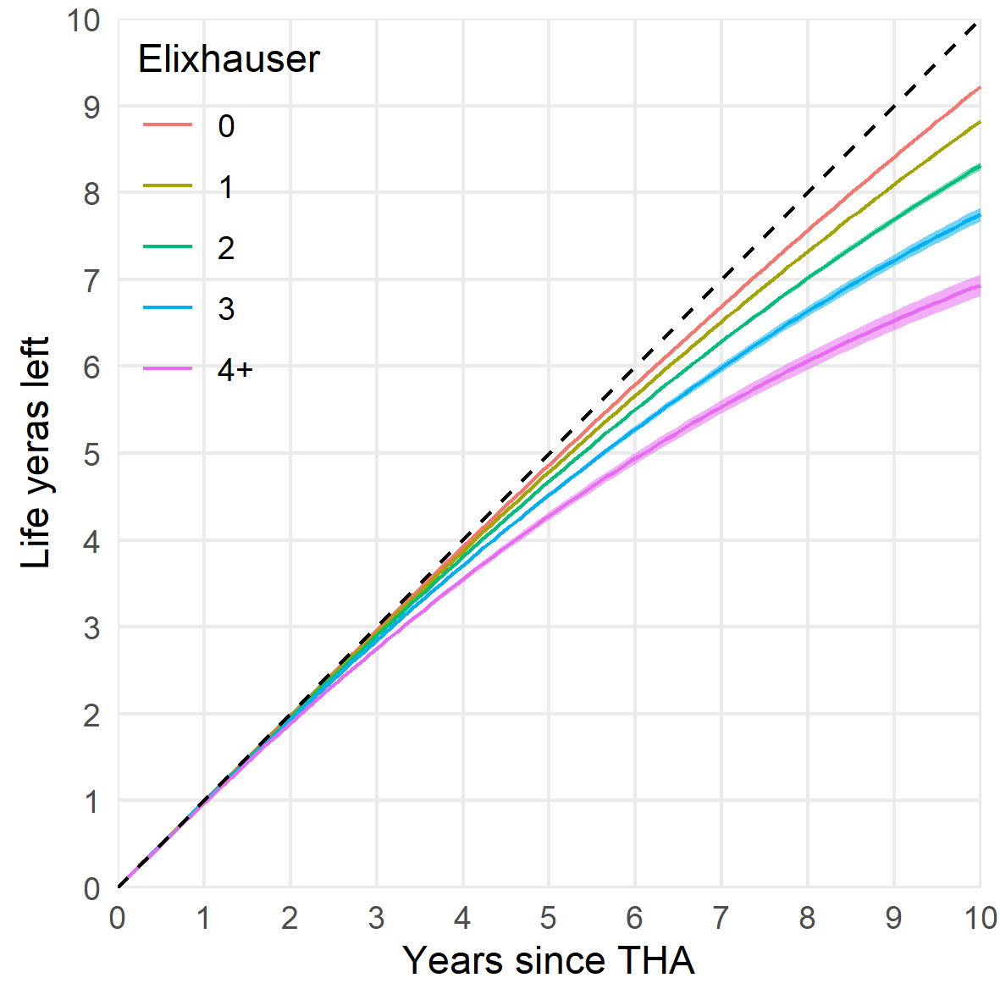

```{r setup, include = FALSE}
options(
  digits            = 1,
  knitr.kable.NA    = '',
  repos = list(CRAN = "https://cran.rstudio.com/")
)
knitr::opts_chunk$set(echo = FALSE, root.dir = '..')
library(tidyverse)
load("../cache/df.RData")
```

ORIGINAL RESEARCH

Bulow et al.

# Restricted mean survival time decrease with increased comorbidity for patients with total hip arthroplasty

Erik Bulow^1,2^
Ola Rolfson^1,2^
Szilard Nemes^1,2,3^


^1^	Swedish Hip Arthroplasty Register, Gothenburg, Sweden. 
^2^	Department of Orthopaedics, Institute of Clinical Sciences, The Sahlgrenska Academy, University of Gothenburg, Gothenburg, Sweden. 
^3^ AstraZeneca, Molndal, Sweden

*Correspondence:* Erik Bulow, SHPR, Registercentrm Vastra Gotaland, 415 43 Gothenburg, Sweden.
Tel: +46 7008234 28. E-mail: erik.bulow@registercentrum.se


# Abstract

<!-- Max 300 words -->

**Purpose — ** We investigated the long-term association between increased comorbidity and remaining life time, for patients with hip arthroplasty (THA) in a Swedish national cohort.

**Patients and methods — ** We studied 120,836 patients operated with THA 1999-2012, recorded in the Swedish Hip Arthroplasty Register, linked to the National Patient Register from the National Board of Health and Welfare. We estimated the restricted mean survival time (RMST), and the restricted mean time lost (RMTL) stratified by the Elixhauser comorbidity score. 

**Results — ** The maximum RMTL 90 days after surgery was 1.1 days. This increased slightly with increased baseline comorbidity. Differences were statistically significant, although likely clinically irrelevant. RMTL 10 years after surgery ranged from 315 days (no comorbidity) to 1,193 days (> 3 comorbidities). Those differences were statistically significant, as well as clinically relevant. 

**Conclusion — ** Baseline comorbidity indicates expected long-term survival after THA.

**Keywords:** survival analysis, hip replacement, Elixhauser, register study


# Introduction

Comorbidity indices (such as proposed by Elixhauser et al. [@Elixhauser1998] or Charlson et al. [@Charlson1987]) are common components of joint replacement studies. It has been showed however that they add little to the understanding of health-related quality of life [@Greene2015a], occurrence of re-operations [@Gordon2013] or mortality [@Bulow2017]. Beside considering comorbidity indices and joint replacement, these papers have yet another common theme, they are predictive studies, and their assessment strictly applies to predictions. Prediction and estimation are often used interchangeably, although a clear distinction should be made [@Shmueli2011]. Predictive studies or risk calculators aim to predict the outcome for a specific patient (or groups of patients with similar characteristics). Baseline comorbidity indices seemingly adds little in this case. Etiological studies of association between exposures and outcomes on the other hand, could still benefit from considering comorbidity on a population level. Such studies have showed that comorbidity indices do affect survival [@Glassou2017], as well as medical expenses [@Penna2019], for patients on average.

Our aim in this paper was to assess the association between the Elixhauser comorbidity score and the expected remaining survival time after total hip arthroplasty (THA). This study is descriptive and departs from usual regression modeling as it does not rely on hazard ratios. Instead, we focus on group specific survival times, a clinically meaningful and model-free measure [@Uno2014; @Irwin1949]. The restricted mean survival time and the restricted mean time lost [@Royston2013] give the average remaining life expectancy of patients, and inversely the life time lost up to a pre-defined time point. Both measures are easily interpreted as their unit is a measure of time (days, months or years) and they are easily estimated at clinically meaningful time points. 


# Patients and Methods


## Patients and data
<!-- In red -->
We identified patients from the Swedish Hip Arthroplasty Register (SHAR) who underwent THA for primary hip osteoarthritis 1999–2015 and who matched our inclusion criteria (Figure \@ref(fig:flowchart)). 
<!-- Stop in red -->

These patients were linked to the Swedish National Patient Register (NPR) [@Cnudde2016] which provided the ICD-10 codes. Individual ICD-10 codes were first identified as different comorbidities, then combined into Elixhauser Comorbidity Index. The window for inclusion ICD-10 codes was set from 366 to 1 day prior to surgery. Patients with no recorded pre-opetative hospital visit were assumed to have no comorbidity, thus ECI = 0. For future details on the patient data please see [@Bulow2017]. 


## Statistical analysis

For each patient we recorded 3 data points, the follow-up time, an event indicator and the pre-operative Elixhauser comorbidity index. The event indicator takes value of 1 if the patient deceased, 0 otherwise. We used the Kaplan-Meier estimator to calculate the survival curves, $S(t)$, stratified by the Elixhauser comorbidity score. The mean survival time is given by $E[T]= \int_0^\infty S(t)dt$, however, this can be estimated only if do not have any censoring and the life length of every patient is known. An alternative to the mean survival time is the $\tau$-restricted mean survival time. Here, we do not aim to follow-up all patients until their death but to a pre-defined length of time, $\tau$. 

RMST is estimated as $\mu(τ)= \int_0^\tau S(t)dt$, and is the average number of years (or any other time interval) before time $\tau$. A natural estimator for $\mu(τ)$ is $\hat \mu(\tau) = \int _0^\tau \hat S (t) dt$  where we replace the survival function by its estimate, the Kaplan-Meier curve. Instead of looking at the life expectancy up to a certain time point, we could estimate the time lost up to that timepoint. The Restricted mean time lost ($RMTL(\tau)$) is given by $\tau-RMST(\tau)$. If $\tau$ is known and fixed, then it follows that $RMTL(\tau)$ is normally distributed and $\sigma_{RMLT(\tau)}^2 = \sigma_{RMST(\tau)}^2$. 
As cut-off time $\tau$τ we used 90 days, 1 year, 5 years and 10 years. The 90 days and 1-year survival are directly interesting from an orthopedic point of view. $RMST$ and $RMTL$ are asymptotically normally distributed [@Andersen2012], so standard statistical routines can be used for confidence interval building and statistical inference. Statistical analyses were run in `r substr(R.version.string, 1, 15)` (R Foundation, Vienna, Austria). 


## Ethics

Ethics approval was obtained from the Regional Ethical Review Board in Gothenburg, Sweden (decision 271-14). 

# Results

```{r}
n <- count(df, ECI) %>% deframe()
p <- sprintf("%.0f %%", n / sum(n) * 100)
```

There were `r n_distinct(df$LopNr)` patients included in the study (**Figure flowchart**). `r p[1]` had no comorbidities, `r p[2]` had one, `r p[3]` had two, `r p[4]` three and `r p[5]` had four or more (Table \@ref(tab:table1)).
From the onset of the follow-up we saw a clear association between survival and ECI (Figure \@ref(fig:rmst)). The expected life time lost increased statistically significantly with comorbidity at all listed time points (Table \@ref(tab:tableres)). Although, at the beginning of the follow-up this difference was statistically significant, we cannot claim clinical significance. The time lost in the first 30 days after the hip replacement surgery did not exceed 6 hours. At the end of the chosen follow-up at 10 years patients with pre-operative Elixhauser score of zero lost in average less than one year expected survival time. This figure increased with Elixhauser score and loss for patients with score 4 or above exceeded 3 years. The restricted men time lost was between factor 2 and factor 8 higher in groups with comorbidities than in patients with Elixhauser score zero. As expected this was less and less notable with passing time (Figure \@ref(fig:rmtl)). 


# Discussion

Neither a clinician nor a survival curve can predict with absolute certainty how long a patient will live, providing estimates on years lost may improve the accuracy of the prognostic estimates that influence clinical decisions and information given to patients [@Couchoud2017]. While for ranking individual survival times comorbidity scores such as the Elixhauser index have low precision [@Bulow2017; @Bulow2019] we have seen here that at group level there are clear separation between patients with different Elixhauser scores. Thus, for health administrative purposes there might be added value in considering comorbidities.

In absolute values the restricted mean time lost increased with time irrespectively of Elixhauser score. The relative loss was higher at the beginning at the follow-up period than at the end. There is an increased short-term mortality after the hip replacement surgery [@Pedersen2011; @Cnudde2018b], and this is likely to be influenced by co-morbidities the patient might have. Though, 90-day restricted mean time lost for the group of patients with Elixhauser index of 4 or more was only **1** day, approximatively **8** times longer than for the group with no-comorbidities. This relative difference decreases with time and at the 10-year follow up patients with Elixhauser index of 4 lose **3.8** times more days that the group with no comorbidities. This convergence of the day restricted mean time lost curves coincides with the decrease of  predictive power reported by Bulow et al. [@Bulow2017]. If we follow-up the dichotomy by Shmueli et al. [@Shmueli2011] we could conclude that predictive studies/risk calculators gain lite from considering the Elixhauser comorbidity index. However, for studies that aim to estimate effects of different treatment options  comorbidity indices can be important confounders and important for case-mix adjustments [@Inacio2015a]. Health-care administrators gain form considering comorbidities by getting better estimates of future need of revisions. The revision rate of hip replacements is low [@Bayliss2017], however with increased survival rates [@Schwartsmann2015] there is need of accurate long term estimates of number patients at risk, and here considering comorbidities could be considered worthwhile. 

# Conclusion

Baseline comorbidity indicates expected long-term survival after THA.

# Disclosure

Grants from the Swedish state under the agreement between the Swedish government and the county councils, the ALF-agreement (ALFGBG-522591), contributed to this study. The authors declare no conflicts of interest.


<!-- Tables -->

```{r table1}
load("../cache/table1.RData")
tableone::kableone(table1, caption = "XXX")
```


```{r tableres}
load("../cache/table_rmst_rmtl.RData")
knitr::kable(table_rmst_rmtl, caption = "XXX")
```


<!-- Figures -->

```{r rmst, fig.cap = "XXX"}

```


```{r rmtl, fig.cap = "XXX"}
knitr::include_graphics("../graphs/rmtl.png")
```

# References
